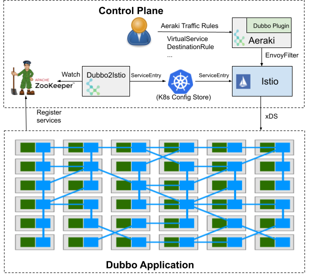
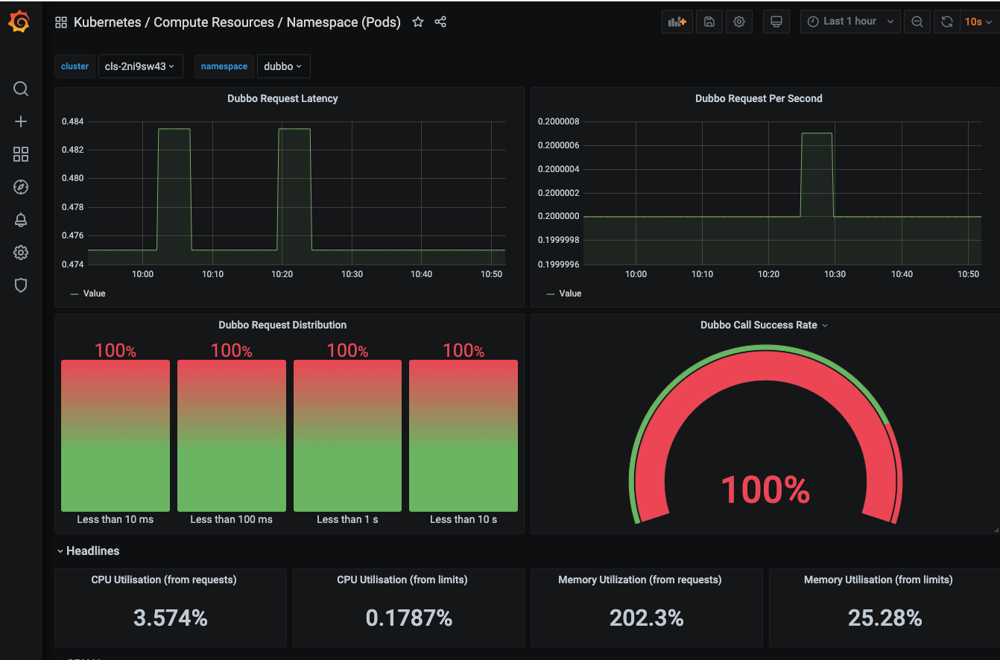

[](https://github.com/aeraki-framework/dubbo2istio/actions?query=branch%3Amaster+event%3Apush+workflow%3A%22e2e-zookeeper%22)
[](https://github.com/aeraki-framework/dubbo2istio/actions?query=branch%3Amaster+event%3Apush+workflow%3A%22e2e-nacos%22)
[](https://github.com/aeraki-framework/dubbo2istio/actions?query=branch%3Amaster+event%3Apush+workflow%3A%22e2e-etcd%22)
# Dubbo2Istio

Dubbo2istio 将 Dubbo 服务注册表中的 Dubbo 服务自动同步到 Istio 服务网格中，目前已经支持 ZooKeeper，Nacos 和 Etcd。

Aeraki 根据 Dubbo 服务信息和用户设置的路由规则生成数据面相关的配置，通过 Istio 下发给数据面 Envoy 中的 Dubbo proxy。

如下图所示， [Aeraki + Dubbo2istio](https://github.com/aeraki-framework/aeraki) 可以协助您将 Dubbo 应用迁移到 Istio 服务网格中，
享用到服务网格提供的高级流量管理、可见性、安全等能力，而这些无需改动一行 Dubbo 源代码。



# Demo 应用

Aeraki 提供了一个 Dubbo Demo 应用，用于使用该 Demo 来测试 Dubbo 应用的流量控制、metrics 指标采集和权限控制等微服务治理功能。
* [Demo k8s 部署文件下载](https://github.com/aeraki-framework/dubbo2istio/tree/master/demo)
* [Demo Dubbo 程序源码下载](https://github.com/aeraki-framework/dubbo-envoyfilter-example)

备注：该 Demo 应用基于开源 Istio + Aeraki 运行，也可以在开通了 Dubbo 服务支持的 
[腾讯云 TCM (Tencent Cloud Mesh)](https://console.cloud.tencent.com/tke2/mesh?rid=8) 托管服务网格上运行。

## 安装 Aeraki

```bash
git clone https://github.com/aeraki-framework/aeraki.git
cd aeraki
./demo/install-demo.sh --noapp
```

## 安装 Dubbo2Istio 和 Demo 应用

执行下面的命令安装 Dubbo Demo 应用：
```bash
kubectl create ns dubbo
# Istio
kubectl label namespace dubbo istio-injection=enabled
# TCM
# kubectl label namespace dubbo istio.io/rev=1-8-1
git clone https://github.com/aeraki-framework/dubbo2istio.git
cd dubbo2istio
# 该示例采用 ZooKeeper 作为注册表，dubbo2istio 也支持 etcd 和 nacos
kubectl apply -f demo/k8s/zk -n dubbo
```
稍等片刻后验证部署的 dubbo Demo 应用。

```bash
➜  dubbo2istio git:(master) kubectl get pod -n dubbo
NAMEREADY   STATUSRESTARTS   AGE
dubbo-sample-consumer-78b4754bb8-wstxd2/2 Running   025s
dubbo-sample-provider-v1-d56ddbf99-kqkzf2/2 Running   026s
dubbo-sample-provider-v2-5797b6bcb8-k4dsf   2/2 Running   026s
dubbo2istio-9cc7d569-d98rm2/2 Running   025s
zookeeper-8598999f77-4287r2/2 Running   024s
```

可以看到 dubbo namespace 中有下面的 pod：
* dubbo-sample-consumer: dubbo 客户端应用
* dubbo-sample-provider-v1： dubbo 服务器端应用（v1版本）
* dubbo-sample-provider-v2： dubbo 服务器端应用（v2版本）
* zookeeper: dubbo zookeeper 服务注册表
* dubbo2istio: TCM 服务同步组件，负责将 dubbo 服务同步到服务网格中

## 验证请求级（七层）负载均衡
Dubbo 使用了长链接，服务网格缺省情况下只能在4层上对客户端的请求进行负载均衡，来自一个客户端链接的请求只能被发送到一个服务器实例上。如果不同客户端的 QPS
不同，客户端发出的请求不能在多个服务器上进行合理的分配，将导致后端的多个服务器压力不均。在服务器由于压力增大水平扩展后，存量的链接也不能被重新分发到服务器端的多个实例上，导致服务器资源利用不均衡，对客户端响应不及时。

当启用了 TCM 的dubbo支持后，服务网格可以在请求层面（七层）上对 dubbo 请求进行精细的负载均衡处理，将来自客户端的请求均匀分配到后端的多个服务器实例上。

从下面客户端日志输出中，我们可以看到 dubbo-sample-consumer 的请求被均匀分配到了后端的两个 dubbo-sample-provider 服务实例上。

```bash
➜  dubbo2istio git:(master) kubectl logs --tail 10 dubbo-sample-consumer-78b4754bb8-wstxd  -c dubbo-sample-consumer -n dubbo
Hello Aeraki, response from dubbo-sample-provider-v2-5797b6bcb8-k4dsf/172.18.0.59
Hello Aeraki, response from dubbo-sample-provider-v1-d56ddbf99-kqkzf/172.18.0.58
Hello Aeraki, response from dubbo-sample-provider-v2-5797b6bcb8-k4dsf/172.18.0.59
Hello Aeraki, response from dubbo-sample-provider-v1-d56ddbf99-kqkzf/172.18.0.58
Hello Aeraki, response from dubbo-sample-provider-v2-5797b6bcb8-k4dsf/172.18.0.59
Hello Aeraki, response from dubbo-sample-provider-v1-d56ddbf99-kqkzf/172.18.0.58
Hello Aeraki, response from dubbo-sample-provider-v2-5797b6bcb8-k4dsf/172.18.0.59
Hello Aeraki, response from dubbo-sample-provider-v1-d56ddbf99-kqkzf/172.18.0.58
Hello Aeraki, response from dubbo-sample-provider-v2-5797b6bcb8-k4dsf/172.18.0.59
Hello Aeraki, response from dubbo-sample-provider-v1-d56ddbf99-kqkzf/172.18.0.58
```

## 验证按版本导流（Traffic Splitting）
首先创建一个 DestinationRule，定义 v1 和 v2 两个 subset。这里采用了 Dubbo 服务注册信息中的 revsion 标签来区分不同版本。

```bash
kubectl apply -f demo/istio/destinationrule.yaml -n dubbo
```

destinationrule.yaml 的定义如下：

```yaml
apiVersion: networking.istio.io/v1alpha3
kind: DestinationRule
metadata:
  name: dubbo-sample-provider
spec:
  host: org.apache.dubbo.samples.basic.api.demoservice
  subsets:
  - name: v1
    labels:
      revision: 1.0-SNAPSHOT
  - name: v2
    labels:
      revision: 2.0-SNAPSHOT
```

定义一个 VirtualService，将 20% 的请求发送到 v1 版本，80% 的请求发送到 v2 版本。

```bash
kubectl apply -f demo/istio/virtualservice-traffic-splitting.yaml -n dubbo
```

virtualservice-traffic-splitting.yaml 的定义如下：

```yaml
apiVersion: networking.istio.io/v1alpha3
kind: VirtualService
metadata:
  name: test-dubbo-route
spec:
  hosts:
    - org.apache.dubbo.samples.basic.api.demoservice
  http:
    - name: "reviews-traffic-splitting"
      route:
        - destination:
            host: org.apache.dubbo.samples.basic.api.demoservice
            subset: v1
          weight: 20
        - destination:
            host: org.apache.dubbo.samples.basic.api.demoservice
            subset: v2
          weight: 80
```

稍等片刻，待规则生效后查看 consumer 的 log 进行验证，可以看到请求按规则设定比例被分发到了不同版本的 provider 实例。

```bash
➜  dubbo2istio git:(master) kubectl logs --tail 10 dubbo-sample-consumer-78b4754bb8-wstxd  -c dubbo-sample-consumer -n dubbo
Hello Aeraki, response from dubbo-sample-provider-v1-d56ddbf99-kqkzf/172.18.0.58
Hello Aeraki, response from dubbo-sample-provider-v1-d56ddbf99-kqkzf/172.18.0.58
Hello Aeraki, response from dubbo-sample-provider-v2-5797b6bcb8-k4dsf/172.18.0.59
Hello Aeraki, response from dubbo-sample-provider-v2-5797b6bcb8-k4dsf/172.18.0.59
Hello Aeraki, response from dubbo-sample-provider-v2-5797b6bcb8-k4dsf/172.18.0.59
Hello Aeraki, response from dubbo-sample-provider-v2-5797b6bcb8-k4dsf/172.18.0.59
Hello Aeraki, response from dubbo-sample-provider-v2-5797b6bcb8-k4dsf/172.18.0.59
Hello Aeraki, response from dubbo-sample-provider-v2-5797b6bcb8-k4dsf/172.18.0.59
Hello Aeraki, response from dubbo-sample-provider-v2-5797b6bcb8-k4dsf/172.18.0.59
Hello Aeraki, response from dubbo-sample-provider-v2-5797b6bcb8-k4dsf/172.18.0.59
```

## 查看 Dubbo 相关的性能指标
在 Istio Grafana 插件或者 TCM 云原生监控界面中查看 Dubbo 调用的性能指标，包括 调用次数、调用延迟、调用成功率，如下图所示：


## 服务权限控制

首先我们需要在服务网格中启用 mtls，以对服务进行身份认证。

```bash
kubectl apply -n istio-system -f - <<EOF
apiVersion: "security.istio.io/v1beta1"
kind: "PeerAuthentication"
metadata:
  name: "default"
spec:
  mtls:
    mode: STRICT
EOF
```

创建认证策略，禁止 dubbo-consumer 访问 dubbo-provider 服务。

```bash
➜  dubbo2istio git:(master) ✗ k apply -f - <<EOF
apiVersion: security.istio.io/v1beta1
kind: AuthorizationPolicy
metadata:
 name: dubbo-test
 namespace: dubbo
spec:
  action: DENY 
  selector:
    matchLabels:
      app: dubbo-sample-provider
  rules:
  - from:
    - source:
        principals: ["cluster.local/ns/dubbo/sa/dubbo-consumer"]
EOF
```

查看 dubbo consumer 的日志，可以看到由于客户端的 service account 被禁止访问而失败

```bash
➜  kubectl logs -f dubbo-sample-consumer-78b4754bb8-2lqzm --tail 2 -c dubbo-sample-consumer -n dubbo
	... 11 more
[28/04/21 07:50:34:034 UTC] DubboClientHandler-org.apache.dubbo.samples.basic.api.demoservice:20880-thread-35  WARN support.DefaultFuture:  [DUBBO] The timeout response finally returned at 2021-04-28 07:50:34.648, response status is 80, channel: /172.18.0.50:60520 -> org.apache.dubbo.samples.basic.api.demoservice/240.240.0.154:20880, please check provider side for detailed result., dubbo version: 1.0-SNAPSHOT, current host: 172.18.0.50
org.apache.dubbo.rpc.RpcException: Invoke remote method timeout. method: sayHello, provider: dubbo://org.apache.dubbo.samples.basic.api.demoservice:20880/org.apache.dubbo.samples.basic.api.DemoService?application=demo-consumer&check=true&init=false&interface=org.apache.dubbo.samples.basic.api.DemoService&pid=1&register.ip=172.18.0.50&remote.application=&revision=1.0-SNAPSHOT&side=consumer&sticky=false&timeout=3000, cause: org.apache.dubbo.remoting.TimeoutException: Waiting server-side response timeout by scan timer. start time: 2021-04-28 07:50:34.646, end time: 2021-04-28 07:50:37.656, client elapsed: 0 ms, server elapsed: 3010 ms, timeout: 3000 ms, request: Request [id=649, version=2.0.2, twoway=true, event=false, broken=false, data=null], channel: /172.18.0.50:60520 -> org.apache.dubbo.samples.basic.api.demoservice/240.240.0.154:20880
	at org.apache.dubbo.rpc.protocol.AsyncToSyncInvoker.invoke(AsyncToSyncInvoker.java:70)
```

修改认证策略，允许 dubbo-consumer 访问 dubbo-provider 服务。

```bash
k apply -f - <<EOF
apiVersion: security.istio.io/v1beta1
kind: AuthorizationPolicy
metadata:
 name: dubbo-test
 namespace: dubbo
spec:
  action: ALLOW
  selector:
    matchLabels:
      app: dubbo-sample-provider
  rules:
  - from:
    - source:
        principals: ["cluster.local/ns/dubbo/sa/dubbo-consumer"]
EOF
```

查看 dubbo consumer 的日志，可以看到访问成功。

```bash
➜  kubectl logs -f dubbo-sample-consumer-78b4754bb8-2lqzm --tail 2 -c dubbo-sample-consumer -n dubbo
Hello Aeraki, response from dubbo-sample-provider-v1-d56ddbf99-kqkzf/172.18.0.58
Hello Aeraki, response from dubbo-sample-provider-v1-d56ddbf99-kqkzf/172.18.0.58
```


## 一些限制

* 多集群环境下，同一个 dubbo service 的多个 provider 实例需要部署在相同的 namesapce 中。
该限制的原因是 aeraki 采用了 dubbo interface 作为全局唯一的服务名，客户端使用该服务名作为 dns 名对服务端进行访问。
而在 Istio 中，一个服务必须隶属于一个 namespace，因此我们在进行多集群部署时，同一个 dubbo service 的多个实例不能存在于不同的 namespace 中。
如果违反了该部署限制，会导致客户端跨 namespace 访问服务器端实例时由于 mtls 证书验证失败而出错。
